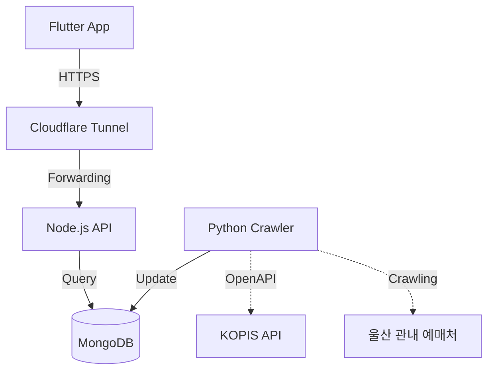

# 🎭 U-Art (Ulsan Art & Performance)


U-Art는 울산 시민들을 위한 **맞춤형 문화예술 공연 통합 플랫폼**입니다. 정부의 KOPIS(공연예술통합전산망) 공공 API와 울산 관내 지자체(중구, 북구, 울주군 등) 문화예술회관의 공연 데이터를 하나로 모아 제공합니다.

---

## ✨ 핵심 기능 (Features)
- 🎫 **통합 공연 검색**: 울산 전역의 공연 일정을 한곳에서 검색하고 필터링 (구/군별 필터 지원)
- 🧠 **스마트 데이터 병합**: KOPIS 공공 데이터의 높은 신뢰성과 지자체 자체 크롤링 데이터(예매 직링크 등)를 지능적으로 병합 (Smart Merge)
- ⭐ **북마크 및 알림**: 관심 있는 공연을 북마크하고 공연 하루 전 Push 알림 제공
- 🔄 **무중단 백그라운드 아키텍처**: PM2와 Cloudflare Tunnel을 활용한 24시간 안정적인 API 통신

---

## 🏗 아키텍처 (Architecture)

U-Art는 모바일 클라이언트와 무중단 백엔드 클러스터로 구성됩니다.



---

## 🛠️ 기술 스택 (Tech Stack)
- **Frontend**: Flutter, Riverpod (상태 관리), GoRouter (라우팅)
- **Backend (API)**: Node.js, Express, Mongoose
- **Backend (Crawler)**: Python 3, BeautifulSoup4, Schedule
- **Database**: MongoDB 6.0 (Docker Containerized)
- **Infrastructure**: Ubuntu Linux, PM2 (Process Manager), Cloudflare Tunnel (Zero Trust)
- **CI/CD**: GitHub Actions

---

## 🚀 시작하기 (Getting Started)

### 1. 필수 환경
- Flutter SDK 3.x 이상
- Node.js & NPM (백엔드 실행 시)
- Python 3.10+ (크롤러 실행 시)
- Docker (MongoDB 구동용)

### 2. 설치 및 실행 (모바일 앱)
```bash
# 1. 저장소 클론
git clone https://github.com/Forevernewvie/u-art.git
cd u-art

# 2. 패키지 설치
flutter pub get

# 3. 앱 실행
flutter run
```

### 3. 풀스택 통합 테스트 실행 (Full-Stack Tests)
```bash
# Flutter (55개) + Python 크롤러/E2E (6개) + Node.js API (3개) 전 구간 원클릭 검증
./run_all_tests.sh
```

### 4. 백엔드 설정 (선택 사항)
백엔드 로컬 실행 및 배포는 `backend/` 또는 개별 서버 설정 가이드를 참고하세요. 환경 변수(`.env`)는 보안상 Github에 포함되지 않으므로 개별 세팅이 필요합니다.

---

## 🛡️ CI/CD 파이프라인 (GitHub Actions)
이 프로젝트는 **Git Flow** 브랜치 전략을 따르며, GitHub Actions를 통해 CI/CD(지속적 통합/배포) 파이프라인이 구축되어 있습니다.
- **Why CI/CD?**: 코드를 푸시할 때마다 자동으로 린트(Lint) 검사와 단위 테스트(Unit Tests)를 수행하여 **버그를 사전에 차단**하고 **코드 품질을 보장**합니다. 또한 릴리스 빌드를 자동화하여 배포 안정성을 극대화합니다.

---
*Developed with ❤️ for Ulsan Citizens.*
