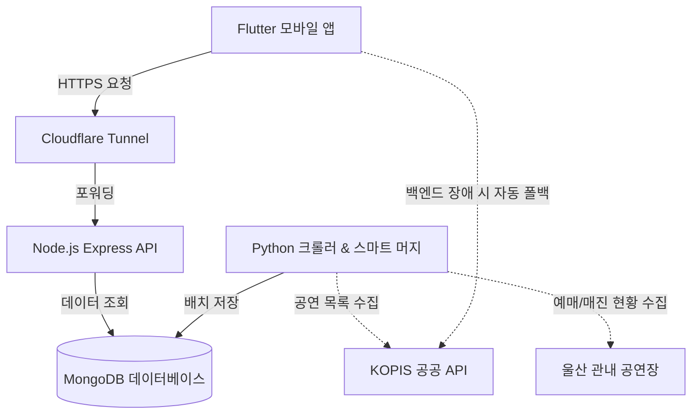
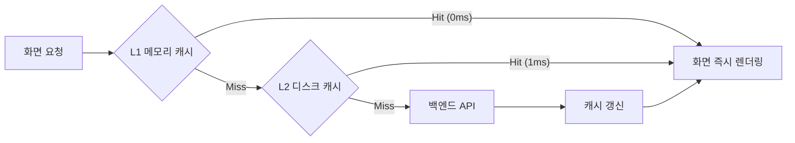
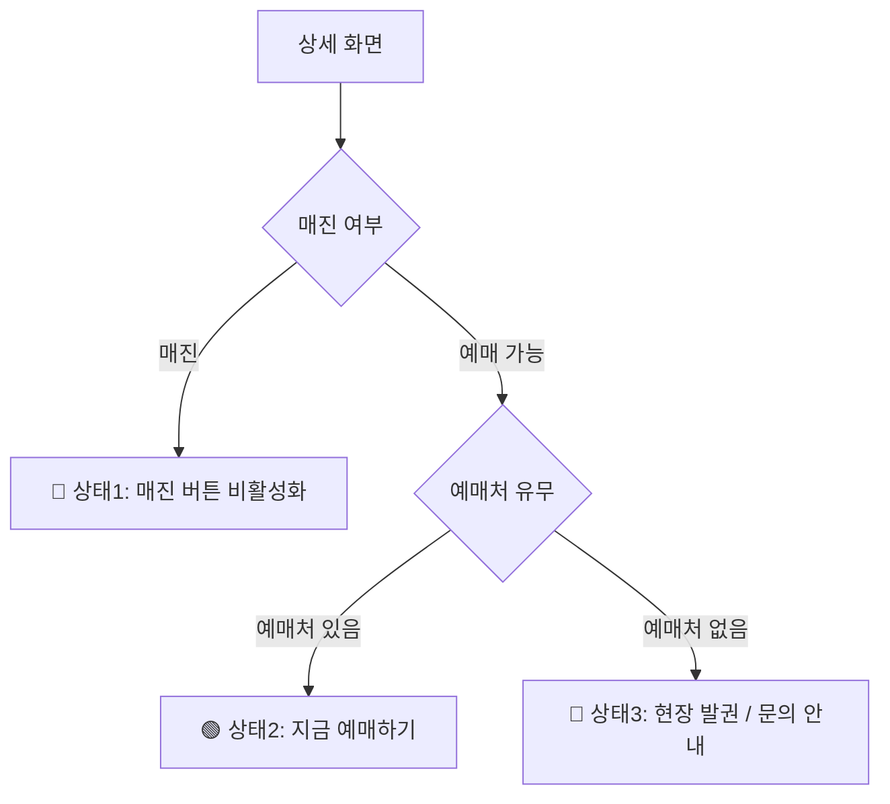
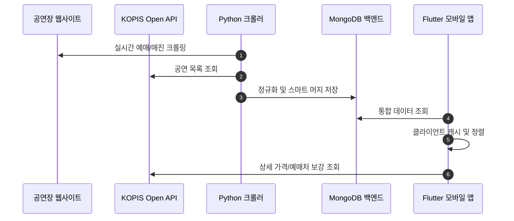

# 🎭 U-Art (Ulsan Art & Performance)


U-Art는 울산 시민들을 위한 **맞춤형 문화예술 공연 통합 플랫폼**입니다. 정부의 KOPIS(공연예술통합전산망) 공공 API와 울산 관내 지자체(중구, 남구, 북구, 울주군, 동구 등) 문화예술회관의 공연 데이터를 하나로 모아 제공합니다.

---

## ✨ 핵심 기능 (Features)

- 🎫 **통합 공연 검색 & 필터링**: 울산 전역의 공연 일정을 한곳에서 검색하고 구/군별·장르별로 필터링
- ⚡ **체감 로딩 0초 SWR 캐싱**: React 없이 Flutter 순수 네이티브 환경에서 구현된 SWR(Stale-While-Revalidate) 아키텍처로 앱 실행 즉시(0~1ms) 목록 렌더링
- 🧠 **지능형 스마트 머지 (Smart Merge)**: KOPIS 공공 데이터(고화질 포스터/메타)와 지자체 자체 크롤링 데이터(상세 홀 명칭/실시간 매진 현황)를 지능적으로 합성
- 🎯 **정확한 티켓 가격 & 3단계 액션 버튼**:
  - 누락된 가격 데이터를 '무료'로 왜곡하지 않는 안전한 기본값 표기
  - KOPIS 상세 API 실시간 자동 보강(R/S석 가격 및 공식 예매처 연동)
  - `매진(Sold Out)` / `지금 예매하기` / `현장 발권 및 공연장 문의 요망` 3단계 직관적 UI 분기
- ⭐ **북마크 및 알림**: 관심 있는 공연을 북마크하고 공연 하루 전 Push 알림 제공
- 📅 **캘린더 연동**: 탭 한 번으로 휴대폰 기본 캘린더에 공연 일정 등록

---

## 🏗 전체 시스템 아키텍처 (Architecture)



<details>
<summary><b>⚡ [자세히 보기] Flutter SWR(Stale-While-Revalidate) 3단계 캐싱 메커니즘</b></summary>

<br>

> [!NOTE]  
> **U-Art는 React를 사용하지 않는 100% Flutter(Dart) 네이티브 앱입니다.**  
> 본 프로젝트의 SWR은 HTTP 표준(RFC 5861)의 캐싱 전략을 **Flutter 순수 코드(Riverpod + SharedPreferences + Memory Cache)**로 자체 구현한 것입니다.

앱 실행 시 사용자가 흰 화면이나 로딩 스피너를 기다릴 필요 없이, 이전에 기기에 저장된 캐시 데이터를 **0.001초(1ms) 만에 즉시 표시(Stale)**하고, 백그라운드(`unawaited`)에서 서버 API를 호출하여 최신 데이터를 조용히 동기화(Revalidate)합니다.



</details>

<details>
<summary><b>🎯 [자세히 보기] 티켓 가격 및 예매 상태 3단계 액션 버튼 분기 로직</b></summary>

<br>

공연 상태에 따라 사용자에게 명확하고 혼란 없는 사용자 경험(UX)을 제공합니다.



</details>

<details>
<summary><b>🔄 [자세히 보기] 종단 간 데이터 수집 & 스마트 머지 파이프라인 시퀀스</b></summary>

<br>



</details>

---

## 🛠️ 기술 스택 (Tech Stack)

- **Frontend (Mobile)**: Flutter 3.x, Dart 3.x, Riverpod (State Management & DI), GoRouter (선언적 라우팅), SharedPreferences (디스크 캐시)
- **Backend (API)**: Node.js, Express, Mongoose, In-Memory 격리 핸들러
- **Backend (Crawler)**: Python 3.14, BeautifulSoup4, Requests, 정규식 기반 Smart Merge 엔진
- **Database**: MongoDB 6.0 (Dockerized)
- **CI/CD**: GitHub Actions (Lint, Analyzer, Tests 분리 및 1분 초고속 검증 파이프라인)

---

## 🧪 테스트 및 품질 보증 (Testing & QA)

U-Art는 철저한 테스트 주도 개발(TDD) 및 엔지니어링 표준을 준수합니다.

```bash
# 전체 풀스택 통합 테스트 (Flutter 72개 + Python 10개 + Node.js 3개)
./run_all_tests.sh
```

- **테스트 커버리지**: **95.92%** (1,129 / 1,177 라인 커버)
- **정적 분석**: `flutter analyze` ➔ **0 Warnings, 0 Errors**
- **풀스택 통합 테스트 통과율**: **85/85 전원 통과 (100% Exit Code 0)**

---

## 🚀 시작하기 (Getting Started)

### 1. 필수 환경
- Flutter SDK 3.x 이상
- Python 3.10+ (크롤러 실행 시)
- Node.js & Docker (백엔드 로컬 실행 시)

### 2. 설치 및 실행 (모바일 앱)
```bash
# 저장소 클론
git clone https://github.com/Forevernewvie/u-art.git
cd u-art

# 패키지 설치
flutter pub get

# 앱 실행 (iOS Simulator / Android Emulator)
flutter run
```

---

*Developed with ❤️ for Ulsan Citizens.*
